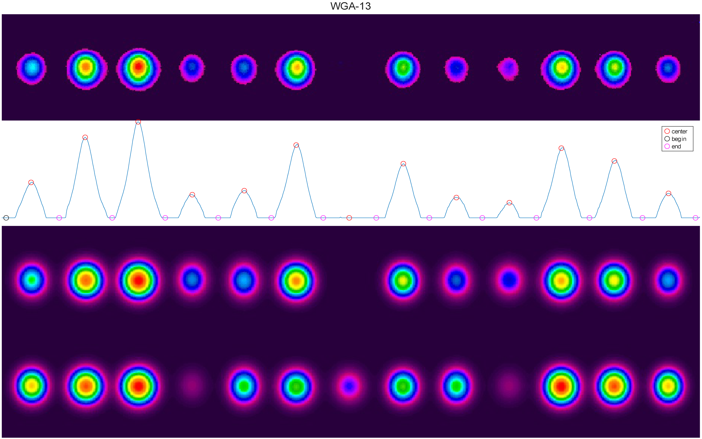
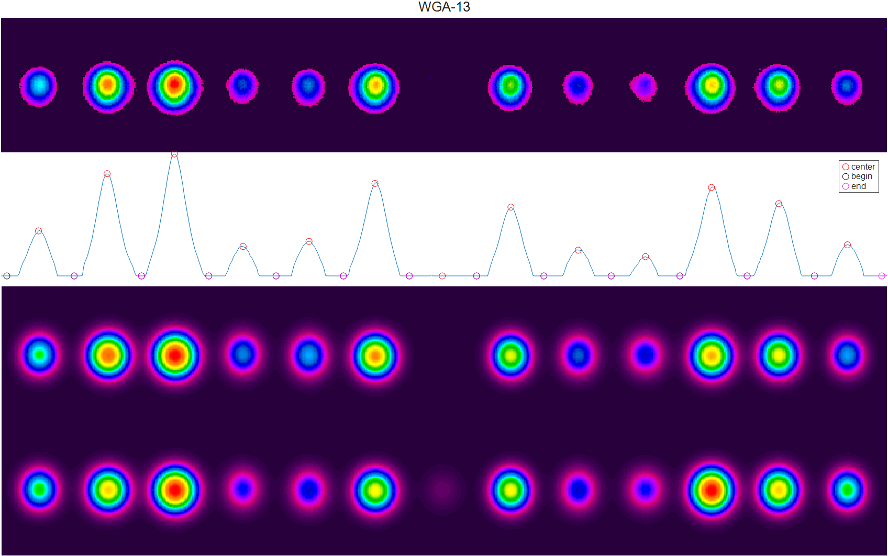
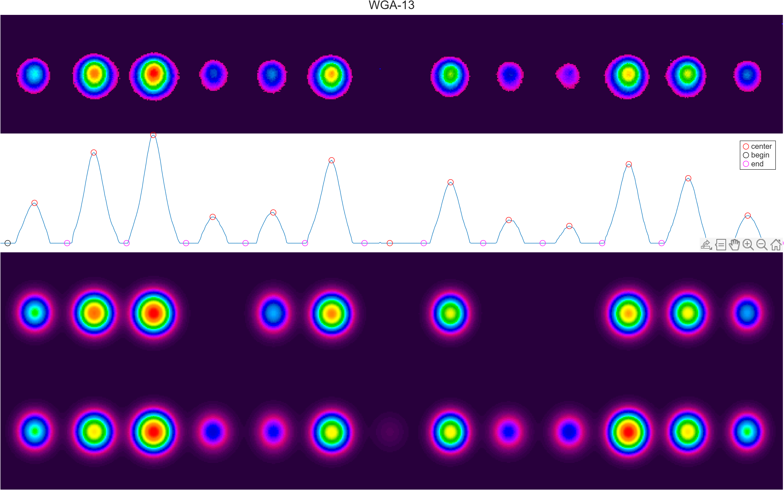

# WGA2kappaCalc
从不同长度阵列演化端面图片倒推计算阵列的耦合系数
## 文件结构
``` matlab
WGA2kappaCalc
│
│  WGA2kappaCalc.m  % 主程序
│
├─images
│      Result_init.zip  % init版本结果
│      WGA-13.png       % init版本识别效果
│      Result_V0.1.zip  % V0.1版本结果
│      2_WGA-13.png     % V0.1版本识别效果
│      Result_V0.2.zip  % V0.2版本结果
│      9μmWGA-13.png    % V0.2版本识别效果
│      Result_V0.3.zip  % V0.3版本结果
├─resource  % 会用到的函数
│      functionSignatures.json  % 自定义代码建议和自动填充
│      gauss2fit.m  % 二维高斯拟合函数
│      OSI_rainbow.mat  % colormap
│      WGA_evaluate.m  % 波导阵列演化计算
│      WGA_evaluate_expm_func.m  % lsqcurvefit使用函数
└─test  % 测试文件,说明详见<WGA2kappaCalc.m>
        WGA-1.tiff
        WGA-2.tiff
        WGA-3.tiff
        WGA-4.tiff
        WGA-5.tiff
        WGA-6.tiff
        WGA-7.tiff
        WGA-8.tiff
        WGA-9.tiff
        WGA-10.tiff
        WGA-11.tiff
        WGA-12.tiff
        WGA-13.tiff
        WGA-14.tiff
        wga_01.bmp
        wga_02.bmp
```
## 更新说明
### V0.4
- 修复识别为单个光斑时提取数目过多
### V0.3
- 采用最小二乘问题的L-M算法计算参数 p=[dl,kappa,EdgeKappa,beta,EdgeBeta,WGNum]
### V0.2
- 修复fig3保存图窗句柄
- 修复fig3 -- fig3+PathNum绘图的采样位置
    > 
    > 第四行(模拟输出)符合度较低
    > 
    > 第四行(模拟输出)采样位置更正
- 将`Path`改为`picInputPath`避免与搜索路径同名
- 增加`.emf`图片输出
- 优化读取路径
- 优化`KappaCalculate.mat`存储名
### V0.1
1. 改进注释说明
2. 优化流程逻辑结构
3. 优化拟合光斑方法
    > 
    > init部分光斑识别不到

    > 
    > V0.1实现改进
4. 优化画图计算逻辑
5. 函数优化并自签名
